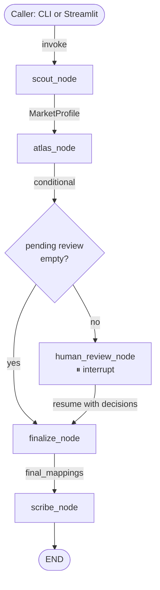

# Mosaic

Mosaic compresses weeks of CPG product master analysis to minutes — three LangGraph agents profile, map, and audit source-to-target harmonization with a quantified confidence score on every decision.

[](https://github.com/yashp919-netizen/mosaic/actions/workflows/eval.yml)
[](LICENSE)


---

## Benchmark

Results from `eval/reports/` — all numbers are real eval runs, no placeholders.

| Metric | Value |
|---|---|
| Mapping F1 — overall (Llama 3.2 8B local) | **0.96** |
| Mapping F1 — UK market (clean schema) | 1.00 |
| Mapping F1 — India market (abbreviated columns) | 0.94 |
| Mapping F1 — Brazil market (Portuguese + noise) | 0.94 |
| Mapping F1 — overall (Gemini 2.5 Flash) | **1.00** |
| ECE (calibration error) | 0.13 — underconfident, not wrong |
| Llama → Gemini F1 delta | +0.04 |
| Atlas latency — local vs cloud | ~106 s vs ~2.45 s per market |
| Cloud cost — full 3-market benchmark | $0.02 |
| Data quality detection rate | 0.83 (test-data poison: 100%; cross-market issues: not detectable per market) |

Full comparison: [`eval/reports/comparison_v1.md`](eval/reports/comparison_v1.md)

---

## Problem

CPG companies operate the same brand portfolio across 100+ countries through inherited ERP, e-commerce, and trade-promotion systems — each with its own product master schema, language, units, and category codes. The same shampoo exists in 40 country systems with different column names, inconsistent allergen flags, mismatched taxonomies, and conflicting packaging hierarchies.

When the enterprise consolidates onto a modern cloud data platform — the kind of program publicly announced by Unilever and Google Cloud in February 2026 — the migration team faces a week-one crisis: producing a unified, governed product master that downstream AI capabilities can trust. Right now they do this in spreadsheets.

Agents change the economics. A statistical profiler that characterizes every column in business language, a semantic mapper that proposes source-to-target alignments with confidence scores, and an auditor that writes lineage records and an executive summary — together they compress weeks of analysis to minutes, with a quantified confidence score on every decision and a human checkpoint on every uncertain one.

---

## Demo

### Architecture



### Walkthrough

[](https://www.loom.com/share/7a333ce48c9f446bbdff384248f1dea6)

**[Watch on Loom →](https://www.loom.com/share/7a333ce48c9f446bbdff384248f1dea6)**  
Brazil market walkthrough: Scout mojibake flag, Atlas confidence color-coding (green ≥ 0.85 / yellow 0.65–0.84 / red < 0.65), human review for low-confidence mappings, Scribe executive summary.

---

## Quickstart

Requires: Python 3.11+, [uv](https://docs.astral.sh/uv/), [Ollama](https://ollama.com/) with `llama3.2:8b` pulled.

```bash
git clone https://github.com/yashp919-netizen/mosaic.git && cd mosaic
uv sync
ollama pull llama3.2:8b
python data/synth/generator.py          # generates market_uk/in/br.csv + ground_truth.json
python -m mosaic.cli run --market uk    # Scout → Atlas → human review → Scribe
streamlit run ui/streamlit_app.py       # Streamlit UI (all three markets)
```

No API keys needed for the local path. For Gemini: copy `.env.example` to `.env` and set `GEMINI_API_KEY`.

**Docker (heuristics only — no Ollama required):**
```bash
cd deploy && docker compose up        # builds image, starts mosaic on :8501
```
The demo image defaults to `MOSAIC_LLM_PROVIDER=none` (embedding + heuristics only, no LLM calls).
For the full Ollama pipeline, the compose file sets `MOSAIC_LLM_PROVIDER=ollama` and starts an Ollama sidecar — the first run pulls `llama3.2:latest` into a Docker volume.

---

## Evaluation

Full methodology: [`docs/eval-methodology.md`](docs/eval-methodology.md)  
Comparison report: [`eval/reports/comparison_v1.md`](eval/reports/comparison_v1.md)

Mosaic's confidence scores are **underconfident** — ECE 0.13 means it assigns lower confidence than the actual accuracy warrants. This is the correct failure mode for enterprise data migration: a falsely confident wrong mapping produces a silently corrupt harmonized master; an underconfident correct mapping produces a 10-second human-review prompt. Conservative is correct.

The Brazil result (F1 0.94, matching India despite Portuguese names, semicolons, and mojibake) was a non-obvious finding: BGE-m3's multilingual training allowed `nome_produto → global_product_name` and `codigo_sku → sku_id` to map at high confidence with no Portuguese-specific heuristics. This is a capability result, not an artifact of the synthetic data.

---

## Architecture

Three LangGraph-orchestrated agents share a typed `MosaicState` object threaded through a `StateGraph` compiled with a `MemorySaver` checkpointer. Full detail: [`docs/architecture.md`](docs/architecture.md)

- **Scout** — reads the source CSV, computes per-column statistics (dtype, null rate, language, samples), and characterizes each column in business language via LLM.
- **Atlas** — embeds source columns and target schema fields using BGE-m3, applies abbreviation heuristics, and proposes mappings with confidence scores; ambiguous cases go to LLM tie-breaking, then to human review if confidence < 0.75.
- **Scribe** — generates a per-SKU lineage record for every source row and writes an LLM-authored executive summary grounded strictly in structured pipeline metrics.

---

## ADR Index

- [ADR-0001: FAISS vs Qdrant](docs/adr/0001-faiss-vs-qdrant.md) — why in-process vector search is correct at v1 scale
- [ADR-0002: LangGraph vs CrewAI](docs/adr/0002-langgraph-vs-crewai.md) — why explicit state machine beats role-based abstraction for auditable pipelines
- [ADR-0003: Three agents, not five](docs/adr/0003-three-agents-not-five.md) — the scoping decision that made the benchmark possible

---

## Honest Limitations

- **No transformation code.** Mosaic produces mappings, not transformations. Converting `DD/MM/YY → ISO 8601` or `oz → grams` is deferred to v2 Alchemist. Every `LineageRecord.transformations_applied` is `[]`.
- **No output validation.** Beyond Pydantic schema checks, there is no adversarial validation of the harmonized master. v2 Sentinel will add this.
- **Synthetic data only.** The benchmark runs on data generated by `data/synth/generator.py`. Calibration and F1 are measured on the same distribution the heuristics were tuned against. Behavior on real-world CPG product masters will differ.
- **Per-market operation.** v1 maps each market independently. Cross-market entity resolution — identifying that UK-12345 and IN-AB9901 are the same product — is not implemented.
- **Allergens as string.** The `allergens` field is stored as a comma-separated string. Parsing against EU CLP or Indian FSSAI codes is a v2 feature.
- **Encoding glitch detection incomplete.** Scout's mojibake heuristics flagged 0% of the planted encoding glitches in the Brazil market (subtle variants). DQ detection rate of 0.83 reflects test-data poison detection only; cross-market and encoding issues are not yet detectable per-market.

Full v2 roadmap: [`docs/v2-roadmap.md`](docs/v2-roadmap.md)

---

## Public-Source Disclaimer

Mosaic is a public-source-informed reference architecture. It is not built with, endorsed by, or representative of any specific company's systems, decisions, or data. The framing is informed by publicly disclosed CPG industry transformation programs, including the Unilever-Google Cloud partnership announced February 17, 2026, publicly reported Unilever scale details, and broader 2026 commentary on SAP S/4HANA migration patterns. All synthetic data, schemas, and agent designs are original to this project.

---

## Stack

| Component | Choice | Why |
|---|---|---|
| Embeddings | BGE-m3 (`BAAI/bge-m3`) | Multilingual, open weights, runs locally, better than OpenAI ada for noisy CPG text |
| Agent framework | LangGraph | Explicit state machine, drawable in interview, native human-in-the-loop support |
| LLM — primary | Llama 3.2 8B via Ollama | Local, free, privacy-aligned, zero data egress |
| LLM — benchmark | Gemini 2.5 Flash via API | 50× faster, +0.04 F1 delta, ~$0.02 for full 3-market benchmark |
| Structured output | Pydantic v2 + instructor | Every agent output typed and validated; LLM outputs constrained via instructor |
| Vector store | FAISS in-process | Zero infra overhead for v1 corpus (~40 vectors); see ADR-0001 |
| Eval | Custom harness | Standard RAGAS does not fit column-mapping tasks |
| Synthetic data | Faker-based generator | Controlled ground truth, deterministic from seed, invented brand names only |
| UI | Streamlit | Fastest demoable UI in a 2-week sprint |
| Deployment | Dockerfile + docker-compose | Local-first with Ollama sidecar; HuggingFace Spaces for public demo |

---

## License

MIT © Kumar Yashvardhan Puri

Inspired by publicly disclosed CPG industry transformation programs. Built independently. See [`docs/public-sources.md`](docs/public-sources.md).
