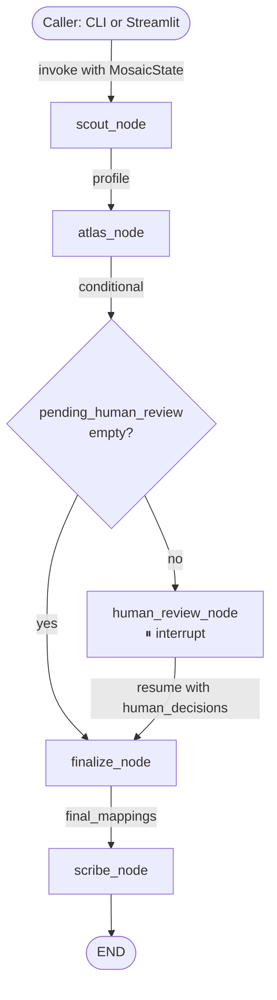

# Mosaic Architecture

## 1. Overview

Mosaic is a three-agent LangGraph pipeline that harmonizes product master data from disparate legacy market schemas into a single governed target schema. A Scout agent statistically profiles each source CSV and characterizes its columns in business language; an Atlas agent proposes source-to-target column mappings using multilingual embeddings, abbreviation heuristics, and LLM reasoning; a Scribe agent generates per-SKU lineage records and an executive summary. All three agents share a typed state object threaded through a LangGraph `StateGraph`, with a human-in-the-loop checkpoint between Atlas and Scribe for low-confidence mappings.

---

## 2. Shared State

`MosaicState` is a `TypedDict` defined in `src/mosaic/orchestrator/state.py`. Every node reads from and writes to this single object; the LangGraph `MemorySaver` checkpointer serializes it to enable the interrupt/resume pattern.

| Field | Type | Set by | Read by |
|---|---|---|---|
| `market_id` | `str` | Caller | Scout, Atlas, Scribe |
| `csv_path` | `str` | Caller | Scout, Scribe |
| `target_schema` | `list[TargetSchemaField]` | Caller | Atlas |
| `llm_provider` | `str` | Caller | All nodes (via `_llm_from_state`) |
| `profile` | `MarketProfile \| None` | Scout | Atlas, Scribe |
| `proposals` | `list[MappingProposal]` | Atlas | Finalize, Scribe |
| `pending_human_review` | `list[MappingProposal]` | Atlas | Human review, Finalize |
| `human_decisions` | `dict[str, str \| None]` | Human review | Finalize |
| `final_mappings` | `list[MappingProposal]` | Finalize | Scribe |
| `lineage_path` | `str` | Scribe | Caller |
| `summary_path` | `str` | Scribe | Caller |
| `executive_summary` | `str` | Scribe | Caller |
| `agent_log` | `list[str]` | Each node appends | Caller / audit |

**Why `source_df` is not in state:** Pandas DataFrames are not JSON-serializable by the `MemorySaver` checkpointer. Carrying a 5,000-row DataFrame in state would silently break the interrupt/resume pattern. Instead, `scribe_node` re-reads the CSV from `csv_path` using the shared `detect_delimiter` utility. This is cheap (disk read, ~1s) and keeps state fully serializable.

---

## 3. Agent Contracts

### Scout

**Reads from state:** `csv_path`, `market_id`, `llm_provider`

**Writes to state:** `profile` (a `MarketProfile`), appends to `agent_log`

**Implementation:** `src/mosaic/agents/scout.py` — `profile_market(csv_path, market_id, characterize, llm_client) -> MarketProfile`

**Prompts used:**
- [`scout_characterize_v1.md`](../src/mosaic/prompts/scout_characterize_v1.md) — given column name, inferred dtype, null rate, language, and value samples, returns `business_description` (1–2 sentences) and `quality_flags` list.

**Key design choices:**
- Statistical profiling (dtype inference, null rate, unique count, language detection) runs without LLM. The `characterize=False` path is fully functional for eval and testing.
- Language detection uses `langdetect` on a sample of non-null string values. Non-string columns get `detected_language=None`.
- Market-level quality issues (high-null columns, mojibake, test-data poison) are detected statistically without LLM.

---

### Atlas

**Reads from state:** `profile`, `target_schema`, `llm_provider`

**Writes to state:** `proposals`, `pending_human_review`, initialises `human_decisions={}`; appends to `agent_log`

**Implementation:** `src/mosaic/agents/atlas.py` — `propose_mappings(market_profile, target_schema, llm_client) -> list[MappingProposal]`

**Prompts used:**
- [`atlas_reasoning_v1.md`](../src/mosaic/prompts/atlas_reasoning_v1.md) — for unambiguous mappings, asks LLM to fill in `reasoning` only (confidence unchanged).
- [`atlas_resolve_v1.md`](../src/mosaic/prompts/atlas_resolve_v1.md) — for ambiguous cases (score gap < 0.10 or score in 0.55–0.80 range), asks LLM to choose from top-3 candidates with structured output: `chosen_field`, `confidence`, `reasoning`. Blended confidence = 0.6 × LLM + 0.4 × embedding.

**Key design choices:**
- Embedding similarity (BGE-m3 / `BAAI/bge-m3`) forms the base score. The model is multilingual — its ability to map Portuguese cognates (`nome_produto` → `global_product_name`) was a non-obvious finding confirmed by the eval.
- Heuristic boosters (defined in `src/mosaic/retrieval/heuristics.py`, not hardcoded in atlas.py) add to the similarity score: exact name match +0.30, substring match +0.15, dtype compat +0.05, known abbreviation patterns +0.20.
- `requires_human_approval = (confidence < 0.75)`. The 0.75 threshold was chosen to route the ambiguous middle — mappings that have a plausible answer but not an obvious one — to a human. See Section 4.

---

### Scribe

**Reads from state:** `csv_path`, `market_id`, `final_mappings`, `proposals`, `human_decisions`, `profile`, `llm_provider`

**Writes to state:** `lineage_path`, `summary_path`, `executive_summary`; appends to `agent_log`

**Implementation:** `src/mosaic/agents/scribe.py` — `generate_lineage(state, source_df)` and `generate_summary(state, records, llm_client)`

**Prompts used:**
- [`scribe_summary_v1.md`](../src/mosaic/prompts/scribe_summary_v1.md) — instructs the LLM to write a 200-word executive summary grounded strictly in the structured input dict. Uses `instructor` with a Pydantic output model (`summary: str`) to prevent metric invention.

**Key design choices:**
- Lineage records use a generated `target_sku_id` (`MSC-{market}-{row_index:06d}`) because the harmonized system does not yet exist. This is an honest v1 placeholder.
- `transformations_applied: []` is explicitly empty in every `LineageRecord`. Transformation generation is deferred to v2 Alchemist. This is documented in `docs/v2-roadmap.md` and in the code comment.
- Executive summary has a plain-text fallback if LLM is unavailable or errors, ensuring the pipeline never halts on summary generation.

---

## 4. Human-in-the-Loop Pattern

**Mechanism:** `human_review_node` calls LangGraph's `interrupt()` with a payload containing the list of `MappingProposal` dicts that need review. This suspends graph execution and returns the interrupt payload to the caller (CLI or Streamlit). The caller collects human decisions and resumes the graph by calling `graph.invoke(Command(resume=decisions), config={"thread_id": ...})`. The `MemorySaver` checkpointer makes the resume seamless — no agent reruns.

**Why 0.75:** Below 0.75, the embedding + heuristic score indicates genuine ambiguity: the top candidate is plausible but not dominant. Routing these to a human adds one correct decision at the cost of ~10 seconds of reviewer time. Above 0.75, the mapping is clear enough that a wrong answer would require the source column to be unusually named — a case the abbreviation heuristics are specifically designed to cover.

**Why underconfidence is the right failure mode for enterprise migration:** A falsely confident wrong mapping produces a silently corrupt harmonized master — the worst possible outcome for a CDO who is about to cut over to a new platform. An underconfident correct mapping produces a human-review prompt — the reviewer approves in 10 seconds and moves on. In data migration, conservative is correct. The v1 calibration finding (Section 5) confirms Mosaic fails in the right direction.

---

## 5. Calibration Finding

Mosaic was benchmarked against `data/synth/ground_truth.json` using the eval harness at `eval/run_eval.py`. Results on the Llama 3.2 8B (local) run:

| Market | F1 | ECE |
|---|---|---|
| UK (clean schema) | 1.00 | 0.05 |
| India (abbreviated columns) | 0.94 | 0.19 |
| Brazil (Portuguese + mojibake) | 0.94 | 0.15 |
| **Overall ECE** | — | **0.1315** |

**What ECE 0.1315 means:** Mosaic's confidence scores are underconfident — it assigns lower confidence than the actual accuracy warrants. A mapping it rates at 0.70 is often actually correct. This is not a calibration failure; it is the right failure mode (see Section 4). The alternative — overconfidence — would suppress human-review prompts for genuinely uncertain mappings.

**Brazil finding:** BGE-m3's multilingual training meant Portuguese cognates (`nome_produto`, `codigo_sku`, `data_lancamento`) mapped to their canonical target fields with unexpectedly high confidence, despite no Portuguese-specific heuristics. The Brazil F1 (0.94) matches India despite far more surface-level noise (Portuguese names, semicolons, mojibake). This is a genuine capability of the model, not an artifact of the synthetic data.

The `encoding_glitch` planted issue (2% of Brazil rows) was not detected by Scout's statistical profiling in v1. Scout flags mojibake via bigram heuristics, but the planted glitches were subtle enough to fall below the detection threshold. This is documented as a known v1 limitation.

---

## 6. Known Limitations of v1

See [`docs/v2-roadmap.md`](v2-roadmap.md) for the full deferred-items list. Summary:

- **No transformation generation.** Mosaic produces mappings, not transformation code. Converting `DD/MM/YY → ISO 8601` or `ounces → grams` is deferred to v2 Alchemist. Every `LineageRecord.transformations_applied` is `[]` in v1.
- **No output validation.** Beyond Pydantic schema checks, there is no adversarial validation of the harmonized master. v2 Sentinel will add this.
- **Per-market operation only.** v1 maps each of the three markets independently. Cross-market entity resolution (identifying that UK-12345, IN-AB9901, and BR-X7723 are the same product) is deferred to v2.
- **Encoding glitch detection incomplete.** Scout's mojibake heuristics flag common patterns but missed the planted 2% glitches in Brazil (subtle encoding variants). Precision-recall on this issue type is unacceptably low in v1.
- **No REST API.** `src/mosaic/api/main.py` is a stub. All interaction is CLI or Streamlit.
- **Calibration measured on this distribution only.** The synthetic data and the heuristics were designed together. Calibration on real-world CPG product masters will differ and should be measured separately.
- **Allergens stored as comma-separated string.** `allergens` is typed `str` in the source schemas; v1 does not parse it into a typed list or validate against EU CLP / Indian FSSAI codes.
- **Gemini LLM path.** `src/mosaic/llm/gemini.py` is scaffolded. The comparative benchmark (Day 9) uses it directly, but the Day 11 state of the repo has it wired into the factory. Operational stability in the full pipeline may need further testing.
